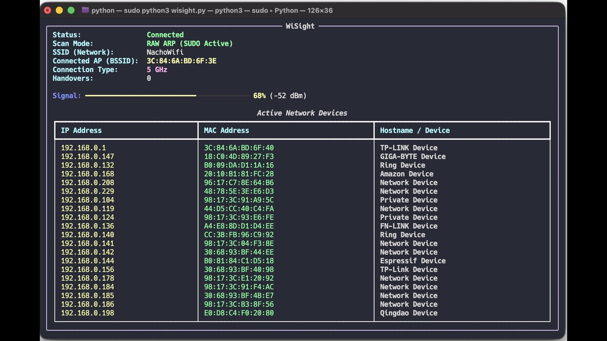

# WiSight 🚀

WiSight is a real-time Wi‑Fi monitoring tool built in Python for macOS, Windows, and Linux. It displays your current Wi‑Fi connection details, tracks roaming events, and scans the local network for connected devices.

It is designed for quick diagnostics and local network awareness from a terminal-based interface.

## ✨ Features

- Live Wi‑Fi connection status
- SSID and BSSID detection
- Signal strength meter
- Roaming / handover tracking
- Local network device scanning
- MAC vendor lookup
- Hostname resolution
- Cross-platform support for:
  - macOS
  - Windows
  - Linux

## 🖥️ What it shows

- Current Wi‑Fi SSID
- Connected access point BSSID
- Signal strength in percent and dBm
- Connection status
- Number of handovers / roaming events
- Active devices discovered on the local network
- Hostname and vendor for detected devices

## 📦 Requirements

Python 3.9+

Install required packages:

```bash
pip install rich
```

Optional for advanced ARP scanning:

```bash
pip install scapy
```

On Linux/macOS, raw ARP scanning may require elevated privileges:

```bash
sudo python3 wisight.py
```

## 🧩 Platform notes

### macOS
WiSight uses:
- `ipconfig getsummary`
- `system_profiler SPAirPortDataType`
- `networksetup`
- `airport` if available

### Windows
WiSight uses:
- `netsh wlan show interfaces`

### Linux
WiSight uses:
- `nmcli`
- `iwgetid`

## 🚀 Usage

Run the app:

```bash
python3 wisight.py
```

If you want to use the raw ARP scanner under sudo:

```bash
sudo python3 wisight.py
```

Press `Ctrl+C` to exit.

## 🔎 How device scanning works

WiSight scans the local network using:
- ARP table fallback
- raw ARP requests when Scapy is available
- hostname resolution via reverse lookup
- MAC vendor lookup via known OUIs and optional public lookup

This helps identify devices connected to the same local network.

## 🛡️ Notes

- Some Wi‑Fi details may appear as `Unknown` or be partially hidden depending on the OS and permissions.
- macOS may redact SSID/BSSID data in some environments.
- Raw Layer‑2 scanning may require elevated privileges.

## 📁 Project structure

```text
python/
├── wisight.py
├── README.md
└── ...
```

## 💡 Future improvements

- Add a web dashboard
- Save logs to file
- Export discovered devices as CSV
- Add a dark/light theme toggle
- Improve Apple Wi‑Fi detection for newer macOS versions

## 📝 License

This project is provided as-is for local network monitoring and diagnostics.

## 🤝 Contributing

Contributions are welcome. If you improve device detection, parsing, or cross-platform compatibility, feel free to open a pull request.

---

Built for local visibility, diagnostics, and Wi‑Fi monitoring.// filepath: /Users/chrisgarey/python/README.md
# WiSight 🚀

WiSight is a real-time Wi‑Fi monitoring tool built in Python for macOS, Windows, and Linux. It displays your current Wi‑Fi connection details, tracks roaming events, and scans the local network for connected devices.

It is designed for quick diagnostics and local network awareness from a terminal-based interface.

## ✨ Features

- Live Wi‑Fi connection status
- SSID and BSSID detection
- Signal strength meter
- Roaming / handover tracking
- Local network device scanning
- MAC vendor lookup
- Hostname resolution
- Cross-platform support for:
  - macOS
  - Windows
  - Linux

## 🖥️ What it shows

- Current Wi‑Fi SSID
- Connected access point BSSID
- Signal strength in percent and dBm
- Connection status
- Number of handovers / roaming events
- Active devices discovered on the local network
- Hostname and vendor for detected devices

## 📦 Requirements

Python 3.9+

Install required packages:

```bash
pip install rich
```

Optional for advanced ARP scanning:

```bash
pip install scapy
```

On Linux/macOS, raw ARP scanning may require elevated privileges:

```bash
sudo python3 wisight.py
```

## 🧩 Platform notes

### macOS
WiSight uses:
- `ipconfig getsummary`
- `system_profiler SPAirPortDataType`
- `networksetup`
- `airport` if available

### Windows
WiSight uses:
- `netsh wlan show interfaces`

### Linux
WiSight uses:
- `nmcli`
- `iwgetid`

## 🚀 Usage

Run the app:

```bash
python3 wisight.py
```

If you want to use the raw ARP scanner under sudo:

```bash
sudo python3 wisight.py
```

Press `Ctrl+C` to exit.

## 🔎 How device scanning works

WiSight scans the local network using:
- ARP table fallback
- raw ARP requests when Scapy is available
- hostname resolution via reverse lookup
- MAC vendor lookup via known OUIs and optional public lookup

This helps identify devices connected to the same local network.

## 🛡️ Notes

- Some Wi‑Fi details may appear as `Unknown` or be partially hidden depending on the OS and permissions.
- macOS may redact SSID/BSSID data in some environments.
- Raw Layer‑2 scanning may require elevated privileges.

## 🧪 Example output


## 📁 Project structure

```text
python/
├── wisight.py
├── README.md
└── ...
```

## 💡 Future improvements

- Add a web dashboard
- Save logs to file
- Export discovered devices as CSV
- Add a dark/light theme toggle
- Improve Apple Wi‑Fi detection for newer macOS versions

## 📝 License

This project is provided as-is for local network monitoring and diagnostics.

## 🤝 Contributing

Contributions are welcome. If you improve device detection, parsing, or cross-platform compatibility, feel free to open a pull request.

---

Built for local visibility, diagnostics, and Wi‑Fi monitoring.
